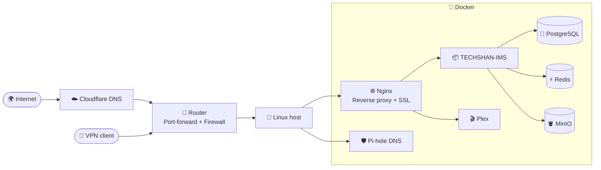

<!-- ===================== HEADER ===================== -->

  

  

  
  
  

---

## 👋 About Me

I'm **Raushan**, originally from **Nepal** 🇳🇵 and now living in **Japan** 🇯🇵. I study **Information Systems** at Global Information Career Academy (グローバル情報キャリア学院). I work on two things: **servers and networks**, and **full-stack software** that runs on them.

Before coming to Japan, I spent **3 years in Qatar** 🇶🇦 doing data entry for an engineering-maintenance company. Two things from that job stayed with me:

- 📉 When the network or an internal system went down, **all the work on site stopped with it.** That's why I want to build and look after infrastructure.
- 📝 A lot of time went into **copying and checking inventory and sales data by hand.** That's why I build software that removes that kind of work.

> 💡 **My strength:** I don't guess when something breaks. I isolate the problem layer by layer (process → port → DNS → router → ISP), fix it, write down what happened, and automate the fix so it doesn't happen again.

---

## 🏠 Home Labber at Heart

I run a **home lab** 🖥️ as my own small data center. It hosts a bunch of **self-hosted services I use every day**. I built it, and I also run and monitor it by myself.

<table>
<tr>
<td width="50%" valign="top">

**🧱 What I run**
- 🐳 **Docker** containers on **Linux**
- 🌐 **Nginx** reverse proxy with **SSL/TLS**
- 🛡️ **Pi-hole** for network-wide ad blocking and local DNS
- 🎬 **Plex** as my media server
- 🗄️ **PostgreSQL · Redis · MinIO** for my own apps
- 📦 **TECHSHAN-IMS**, running in production on my own hardware

</td>
<td width="50%" valign="top">

**⚙️ How I run it**
- 🔌 Router port forwarding and **DNS** name resolution
- 🔥 **Firewall** access control and **VPN** remote access
- 📊 Monitoring and log-based troubleshooting (`ping`, `traceroute`, `dig`, logs)
- 🤖 Automated **backups and deployments** (shell scripts + CI/CD)
- 🧪 Changes go to **staging → production**
- 📚 Every setup and fix is **documented**

</td>
</tr>
</table>

---

## 🚀 Featured Project: TECHSHAN-IMS

An **inventory management system** that I design, build, and run by myself. It's my fix for the manual data work I did in Qatar.

| Layer | Tech |
|---|---|
| 🎨 Frontend | Next.js · React |
| ⚙️ Backend | Node.js · Express · TypeScript |
| 🗄️ Data | PostgreSQL · Redis · MinIO |
| 🖥️ Desktop | Electron + SQLite, **works offline and syncs automatically when the connection comes back** |
| 🚢 Ops | Docker · Nginx · home lab hosting · GitHub branch workflow · staging → production |

**Features:** authentication, sales, purchasing, reports and business documents, and database design built from scratch.

🤖 I use **AI coding tools** to move fast, but I don't ship code I haven't checked. I read what they produce, check it against the official docs, and test it before it goes in.

---

## 💻 Tech Stack

**☁️ Infrastructure & DevOps**

  

  
  
  
  
  
  

**🧑‍💻 Development**

  

**🗄️ Databases**

  

---

## 🎓 Education & Certifications

| | |
|---|---|
| 🏫 **Global Information Career Academy** (Japan) | Information Systems · 2025 – present |
| 🗾 **Tokyo Management College – Global Study Center** (Japan) | Japanese language · 2023 – 2025 |
| 📘 **Reliance International Academy** (Nepal) | +2 (Higher Secondary) · 2016 – 2018 |
| 🏅 **TOEIC 835** | 2024 |
| 🇯🇵 **JLPT N3** | 2024 |

**🗣️ Languages:** English (TOEIC 835) · Japanese (JLPT N3) · Nepali

---

## 🎯 What I'm Looking For

- 🔧 **Network and infrastructure roles:** building and running servers and networks, with the goal of moving into **cloud infrastructure design**
- 🤝 Working on projects in **server infrastructure, self-hosting and scalable backends**
- 🌱 Currently learning: advanced Linux administration, container orchestration, networking, and cloud architecture

**Outside tech:** 📖 reading · 🏃 running · 🎬 movies

---

## 📊 GitHub Stats

  
  

  

---

  
  
  

  

